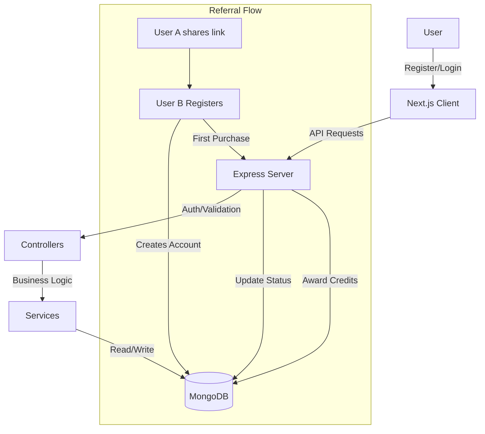

# Referral & Credit System

A full-stack application demonstrating a scalable referral and credit system. Users can sign up, share unique referral links, and earn credits when their referrals make a purchase.

## 📋 Table of Contents

- [Features](#-features)
- [Tech Stack](#-tech-stack)
- [Architecture](#-architecture)
- [Getting Started](#-getting-started)
- [Environment Variables](#-environment-variables)
- [API Documentation](#-api-documentation)
- [System Design](#-system-design)

## ✨ Features

- **User Authentication**: Secure registration and login using JWT.
- **Referral System**: Unique referral links for every user.
- **Credit Rewards**: Both referrer and referred user earn 2 credits on the first purchase.
- **Dashboard**: Real-time tracking of referrals, conversions, and credit balance.
- **Purchase Simulation**: "Make First Purchase" feature to trigger referral conversion.
- **Responsive Design**: Modern UI built with Tailwind CSS.

## 🚀 Tech Stack

**Frontend:**
- **Next.js** (React Framework)
- **TypeScript**
- **Tailwind CSS**
- **Zustand** (State Management)

**Backend:**
- **Node.js** & **Express**
- **TypeScript**
- **MongoDB** & **Mongoose**
- **JWT** (Authentication)

## 🏗 Architecture

The application follows a clean, modular architecture:

- **Client**: Handles UI, state management, and API interactions.
- **Server**: RESTful API with layered architecture (Routes -> Controllers -> Services -> Models).
- **Database**: MongoDB for persistent storage of Users, Referrals, and Purchases.

## 🏁 Getting Started

### Prerequisites
- Node.js (v18+)
- MongoDB (Local or Atlas)

### Installation

1. **Clone the repository**
   ```bash
   git clone <repository-url>
   cd referral-credit-system
   ```

2. **Setup Server**
   ```bash
   cd server
   npm install
   # Create .env file (see Environment Variables)
   npm run dev
   ```

3. **Setup Client**
   ```bash
   cd client
   npm install
   # Create .env.local file (see Environment Variables)
   npm run dev
   ```

4. **Access App**
   Open [http://localhost:3000](http://localhost:3000) in your browser.

## 🔑 Environment Variables

### Server (`server/.env`)
```env
PORT=5000
MONGODB_URI=mongodb://localhost:27017/referral-system
JWT_SECRET=your_super_secret_key_change_this
CLIENT_URL=http://localhost:3000
```

### Client (`client/.env.local`)
```env
NEXT_PUBLIC_API_URL=http://localhost:5000
```

## 📡 API Documentation

| Method | Endpoint | Description | Auth Required |
| :--- | :--- | :--- | :--- |
| **POST** | `/auth/register` | Register a new user | No |
| **POST** | `/auth/login` | Login user | No |
| **GET** | `/auth/profile` | Get current user profile | Yes |
| **GET** | `/referral/stats` | Get referral statistics | Yes |
| **GET** | `/referral/referred-users` | Get list of referred users | Yes |
| **POST** | `/purchase/first-purchase` | Simulate first purchase | Yes |

## 📐 System Design

### Data Flow & Architecture



### Database Schema

- **User**: `name`, `email`, `password`, `referralCode`, `credits`
- **Referral**: `referrer` (User), `referredUser` (User), `status` (pending/converted)
- **Purchase**: `user` (User), `amount`, `isFirstPurchase`

---

## 🌐 Deployed Links

- **Client Application**: [https://referral-credit-system-bice.vercel.app/](https://referral-credit-system-bice.vercel.app/)
- **Server Application**: [https://referral-credit-system-qffn.onrender.com](https://referral-credit-system-qffn.onrender.com)

Built for the FileSure.
